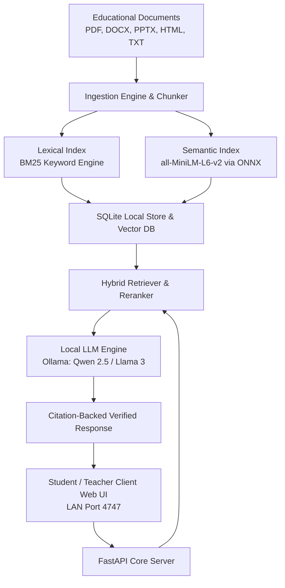

# EduRAG: Private, Air-Gapped Campus AI & Retrieval-Augmented Generation Platform

[](https://www.python.org/downloads/)
[](https://fastapi.tiangolo.com)
[](https://ollama.com)
[](https://onnxruntime.ai)
[](https://opensource.org/licenses/MIT)
[](#privacy--security-architecture)

EduRAG is an enterprise-grade, privacy-first **Local Retrieval-Augmented Generation (RAG) platform** engineered for schools, universities, and educational institutions. It empowers educators to index syllabi, textbooks, research papers, lecture slides, and question banks, providing students with verified, citation-backed AI answers—**running 100% on-premises over Local Area Networks (LAN) with zero cloud dependency and zero telemetry**.

---

## System Architecture



---

## Core Capabilities

### 1. 100% Offline & Air-Gapped Privacy
* **Zero Cloud Exposure:** All document ingestion, vector calculations, and LLM inference execute entirely on local hardware.
* **Strict Confidentiality:** Student queries, examination materials, and proprietary institutional curriculum never touch external servers or third-party APIs.

### 2. Multi-Format Institutional Ingestion Engine
* **High-Fidelity Document Parsers:** Native extraction for **PDF** (`PyMuPDF`), **Word Documents** (`python-docx`), **PowerPoint Slides** (`python-pptx`), **HTML**, and **Markdown/Text**.
* **Intelligent Heading & Section Awareness:** Automatically structures long documents into context-preserving semantic chunks with table and metadata preservation.
* **Optional OCR Pipeline:** Graceful fallback for scanned textbook pages and images.

### 3. State-of-the-Art Hybrid Retrieval
* **Reciprocal Rank Fusion (RRF):** Fuses sparse BM25 keyword matching with dense 384-dimensional vector embeddings (`all-MiniLM-L6-v2`) executed at microsecond latencies via **ONNX Runtime**.
* **Precise Footnote Citations:** Responses cite exact source documents, page numbers, and chunk excerpts, virtually eliminating hallucinations.

### 4. Role-Based Educational Portals
* **Teacher Portal:** Create courses, upload files or entire directories, trigger background vector indexing, and inspect document ingestion statuses.
* **Student Portal:** Interactive query interface with real-time streaming, course filtering, source inspection modals, and persona-driven tutoring modes.
* **Admin Console:** System hardware diagnostics (GPU VRAM, CPU load, memory utilization), active connection monitors, and institutional user management.

### 5. Campus LAN Deployment (1 Server to Many Clients)
* One server PC with a consumer or workstation GPU (e.g. RTX 3060 12GB or higher) can serve a full computer lab or classroom over standard Wi-Fi or Ethernet switches on port `4747`.
* Client devices need **zero installation and zero Python**—they connect through any modern browser (Chrome, Edge, Safari, Firefox).

---

## Quick Start Guide

### Prerequisites
* **Operating System:** Windows 10/11, Ubuntu 22.04+, or macOS
* **Python:** Version 3.10 or 3.11
* **Local LLM Engine:** [Ollama](https://ollama.com/download) installed locally

### Installation

1. **Clone the Repository:**
   ```bash
   git clone https://github.com/razeltech/EduRAG.git
   cd EduRAG
   ```

2. **Create and Activate Virtual Environment:**
   ```bash
   python -m venv .venv
   
   # Windows (PowerShell)
   .venv\Scripts\Activate.ps1
   
   # Linux / macOS
   source .venv/bin/activate
   ```

3. **Install Dependencies:**
   ```bash
   pip install -r requirements.txt
   ```

4. **Pull the Recommended Model (via Ollama):**
   ```bash
   ollama pull qwen2.5:7b-instruct
   ```

5. **Start the EduRAG Server:**
   ```bash
   python run.py
   ```

The server will automatically bind to `0.0.0.0:4747` and launch your browser at `http://127.0.0.1:4747`.

---

## Default Credentials (Demo Mode)

| Role | Email | Password | Access Scope |
| :--- | :--- | :--- | :--- |
| **Teacher** | `teacher@edurag.local` | `teacher123` | Course creation, document indexing, Q&A |
| **Student** | `student@edurag.local` | `student123` | Interactive Q&A, source citation view |
| **Admin** | `admin@edurag.local` | `admin123` | Full system audit, hardware profiler, user manager |

---

## Multi-PC Campus Network Setup

To allow student and classroom PCs to access EduRAG across your local network:

1. **Identify the Server LAN IP:**
   On the host machine running EduRAG, run:
   ```powershell
   ipconfig   # Look for IPv4 Address (e.g., 192.168.1.15)
   ```

2. **Configure Windows Defender Firewall (Run once as Administrator on Server):**
   ```powershell
   New-NetFirewallRule -DisplayName "EduRAG LAN Port" -Direction Inbound -LocalPort 4747 -Protocol TCP -Action Allow -Profile Private
   ```

3. **Access from Client Devices:**
   Open any web browser on student laptops, tablets, or lab PCs connected to the same Wi-Fi/switch:
   ```text
   http://192.168.1.15:4747
   ```

---

## Configuration (`config.yaml`)

EduRAG is customized via `config.yaml` in the project root:

```yaml
app:
  name: "EduRAG Institutional Server"
  port: 4747
  host: "0.0.0.0"

rag:
  model: "qwen2.5:7b-instruct"      # Default local Ollama model
  top_k: 6                          # Retrieved context chunks
  min_score: 0.35                   # Semantic relevance threshold
  hybrid_weight: 0.65               # Balance between Dense Vector & BM25

embedding:
  model_name: "all-MiniLM-L6-v2"    # Offline ONNX embedding model
  dimension: 384

database:
  path: "data/edurag.db"
```

---

## Standalone Binary Release

For production classroom deployment on fresh Windows PCs without requiring Python or pip:
* Built with PyInstaller `--onedir` mode.
* Bundles all necessary runtimes, models, and assets into `EduRAG-Server.exe`.
* See `docs/architecture.md` for compilation and distribution details.

---

## License

This project is licensed under the MIT License — see the [LICENSE](LICENSE) file for details.

Developed with precision by **[Razel Tech](https://github.com/razeltech)**.
